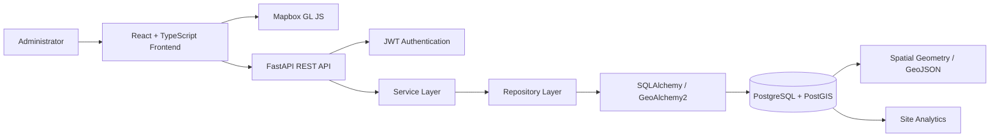
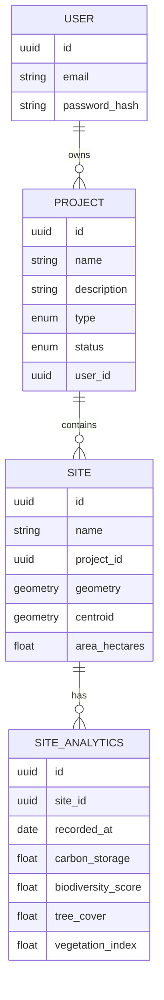
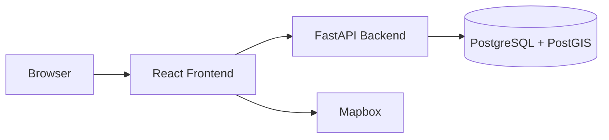

# Darukaa.Earth — Environmental Intelligence Platform

> A full-stack geospatial environmental intelligence platform for managing environmental projects, drawing geographical sites, and exploring carbon, biodiversity, vegetation, and tree-cover demonstration analytics over time.

[](https://github.com/VigneshrajNadar/darukaa-earth/actions/workflows/ci.yml)

**GitHub Repository:** https://github.com/VigneshrajNadar/darukaa-earth

**Live Demo:** `https://darukaa-earth-lime.vercel.app/`

---

## Table of Contents

- [Overview](#overview)
- [Core User Stories](#core-user-stories)
- [Key Features](#key-features)
- [Technology Stack](#technology-stack)
- [Architecture](#architecture)
- [Repository Structure](#repository-structure)
- [Application Workflow](#application-workflow)
- [Authentication](#authentication)
- [Project Management](#project-management)
- [Geospatial Site Management](#geospatial-site-management)
- [Map Experience](#map-experience)
- [Environmental Analytics](#environmental-analytics)
- [Performance Score](#performance-score)
- [Environmental Indicators](#environmental-indicators)
- [Site Comparison](#site-comparison)
- [Data Strategy and Provenance](#data-strategy-and-provenance)
- [Database Schema](#database-schema)
- [PostGIS Design](#postgis-design)
- [API Overview](#api-overview)
- [Environment Variables](#environment-variables)
- [Local Development Setup](#local-development-setup)
- [Demo Data Seeding](#demo-data-seeding)
- [Testing](#testing)
- [Code Quality and Developer Experience](#code-quality-and-developer-experience)
- [CI/CD](#cicd)
- [Deployment Architecture](#deployment-architecture)
- [Security Considerations](#security-considerations)
- [Engineering Trade-offs](#engineering-trade-offs)
- [Limitations](#limitations)
- [Reviewer Walkthrough](#reviewer-walkthrough)
- [Future Improvements](#future-improvements)

---

## Overview

Darukaa.Earth is a full-stack geospatial environmental intelligence platform designed around project and site management, interactive geospatial visualization, and environmental time-series analysis.

The application allows administrators to:

- Register and authenticate using JWT-based authentication
- Create environmental projects
- Add multiple geographical sites to projects
- Draw site boundaries directly on an interactive Mapbox map
- Store and process site geometry using PostgreSQL + PostGIS
- Filter and explore sites geographically
- Select individual sites and inspect detailed analytics
- Analyze environmental trends over time
- Compare up to three sites
- View application-defined environmental indicators and performance metrics

The product is designed as a **decision-support interface**. Environmental analytics in the current demonstration are synthetic and are clearly labeled as demonstration data.

---

## Core User Stories

### 1. Create projects and add multiple sites

```text
Create Project
      ↓
Select Project
      ↓
Open Map
      ↓
Draw Polygon
      ↓
Save Site
      ↓
Repeat for additional sites
```

### 2. View projects and sites on an interactive map

```text
Projects
   ↓
Interactive Map
   ↓
Project Filter
   ↓
Site Polygons
   ↓
Site Selection
```

### 3. Click a site and view analytics over time

```text
Map
 ↓
Click Site
 ↓
Site Popup
 ↓
View Details
 ↓
Environmental Analytics
 ↓
Trend Charts
```

---

## Key Features

### Authentication

- User registration
- User login
- bcrypt password hashing
- JWT access-token authentication
- Bearer-token API requests
- Protected API routes
- Authenticated user context

### Project Management

- Create projects
- View projects
- Project type and status
- Project/site relationships
- Project-based site filtering

### Geospatial Site Management

- Draw polygons using Mapbox Draw
- Associate sites with projects
- Server-side GeoJSON validation
- PostgreSQL/PostGIS geometry storage
- Server-side area calculation
- Centroid calculation
- Site selection
- Site zoom/focus
- Site popup actions

### Environmental Analytics

- Carbon Storage
- Tree Cover
- Biodiversity
- Vegetation
- Historical time-series visualization
- Previous-period comparison
- Environmental indicators
- Application-defined Performance Score
- Demonstration-data provenance

### Site Comparison

- Compare up to 3 sites
- URL-based comparison state
- Multi-site trend chart
- Comparison table
- Current and previous values
- Absolute and percentage changes where available

### Developer Experience

- TypeScript
- ESLint
- Prettier
- Ruff
- pytest
- Vitest
- Husky
- lint-staged
- GitHub Actions
- PostgreSQL/PostGIS integration testing

---

## Technology Stack

| Layer | Technology | Purpose |
|---|---|---|
| Frontend | React | UI framework |
| Language | TypeScript | Type safety |
| Build Tool | Vite | Development and production builds |
| Routing | React Router | Client-side routing |
| Styling | Tailwind CSS | UI styling |
| HTTP Client | Axios | API communication |
| Mapping | Mapbox GL JS | Interactive maps |
| Drawing | Mapbox Draw | Polygon creation |
| Charting | Chart.js | Environmental visualization |
| Backend | FastAPI | REST API |
| Validation | Pydantic v2 | Request/response validation |
| ORM | SQLAlchemy 2 | Database access |
| Spatial ORM | GeoAlchemy2 | PostGIS integration |
| Database | PostgreSQL | Relational storage |
| Spatial Database | PostGIS | Geospatial storage and queries |
| Migrations | Alembic | Database migrations |
| Authentication | JWT | Access-token authentication |
| Password Hashing | bcrypt / Passlib | Password security |
| Frontend Testing | Vitest + React Testing Library | Frontend tests |
| Backend Testing | pytest | Backend tests |
| Frontend Linting | ESLint | JavaScript/TypeScript quality |
| Python Linting | Ruff | Python quality |
| Formatting | Prettier | Code formatting |
| Git Hooks | Husky + lint-staged | Pre-commit checks |
| CI | GitHub Actions | Automated quality checks |

---

## Architecture



### Backend Architecture

The backend follows:

```text
HTTP Request
     ↓
API Router
     ↓
Pydantic Schema
     ↓
Service Layer
     ↓
Repository Layer
     ↓
SQLAlchemy / GeoAlchemy2
     ↓
PostgreSQL + PostGIS
```

### Separation of Concerns

| Layer | Responsibility |
|---|---|
| Routes | HTTP handling, authentication dependencies, response handling |
| Schemas | Request/response validation and API contracts |
| Services | Business logic |
| Repositories | Database queries and data access |
| Models | SQLAlchemy ORM and spatial models |
| Database | PostgreSQL/PostGIS persistence |

---

## Repository Structure

```text
darukaa-earth/
│
├── .github/
│   └── workflows/
│       ├── ci.yml
│       └── deploy.yml
│
├── .husky/
│   └── pre-commit
│
├── docs/
│   └── DATASETS.md
│
├── frontend/
│   ├── src/
│   │   ├── analytics/
│   │   ├── components/
│   │   ├── context/
│   │   ├── hooks/
│   │   ├── layouts/
│   │   ├── pages/
│   │   ├── services/
│   │   ├── tests/
│   │   ├── types/
│   │   └── utils/
│   ├── package.json
│   ├── package-lock.json
│   ├── vite.config.ts
│   ├── tsconfig.json
│   └── tailwind.config.js
│
├── backend/
│   ├── app/
│   │   ├── api/
│   │   │   ├── deps.py
│   │   │   └── routes/
│   │   │       ├── auth.py
│   │   │       ├── analytics.py
│   │   │       ├── dashboard.py
│   │   │       ├── health.py
│   │   │       ├── projects.py
│   │   │       └── sites.py
│   │   ├── core/
│   │   ├── db/
│   │   ├── models/
│   │   ├── repositories/
│   │   ├── schemas/
│   │   └── services/
│   ├── alembic/
│   │   └── versions/
│   ├── data/
│   │   └── demo/
│   ├── scripts/
│   │   └── seed_demo_data.py
│   ├── tests/
│   ├── main.py
│   ├── alembic.ini
│   ├── pyproject.toml
│   ├── requirements.txt
│   └── requirements-dev.txt
│
├── .env.example
├── .gitignore
├── .lintstagedrc.json
├── docker-compose.yml
├── package.json
└── README.md
```

---

## Application Workflow

### Authentication

```text
Register
   ↓
Login
   ↓
JWT Access Token
   ↓
Authenticated Application
```

### Project Creation

```text
Projects
   ↓
Create Project
   ↓
Project Details
   ↓
POST /api/v1/projects
   ↓
Project Persisted
```

### Site Creation

```text
Map
 ↓
Select Project
 ↓
Add Site
 ↓
Draw Polygon
 ↓
Complete Polygon
 ↓
Save New Site
 ↓
POST /api/v1/sites
 ↓
PostGIS
 ↓
Site Appears on Map
```

### Site Analysis

```text
Map
 ↓
Select Site
 ↓
Popup
 ↓
View Details
 ↓
Site Analytics
```

---

## Authentication

Darukaa.Earth uses basic JWT access-token authentication.

### Registration

User registration creates an account and stores a bcrypt-hashed password.

Passwords are not stored as plain text.

### Login

Login:

1. validates the supplied credentials
2. verifies the password hash
3. generates a signed JWT access token
4. returns the token to the frontend

### API Authentication

Authenticated requests use:

```http
Authorization: Bearer <JWT>
```

Protected API routes resolve the authenticated user from the JWT.

Projects and sites are associated with the authenticated user context.

### Current Authentication Scope

The current hackathon implementation focuses on JWT-based access-token authentication.

Not currently implemented:

- Refresh-token rotation
- Email verification
- Password reset
- Role-based authorization

These are documented as future improvements rather than required functionality for the current challenge.

---

## Project Management

Administrators can create and view environmental projects.

Projects contain information such as:

- Project name
- Description
- Project type
- Project status
- Associated sites
- Area/site aggregates where available

Project information is persisted through the FastAPI backend and PostgreSQL database.

---

## Geospatial Site Management

Geospatial functionality is one of the core parts of the application.

### Creating a Site

1. Select a project.
2. Click **Add Site**.
3. Activate polygon drawing.
4. Draw the site boundary on the map.
5. Complete the polygon.
6. Enter site information.
7. Save the site.
8. Backend validates the geometry.
9. PostGIS persists the geometry.
10. Server-side calculations provide area and centroid.
11. The site becomes visible on the map.

### Geometry Validation

The backend validates:

- Missing geometry
- Unsupported geometry types
- Malformed coordinates
- Insufficient vertices
- Unclosed rings
- Invalid/self-intersecting polygons

The backend remains the authoritative source for geometry validation.

---

## Map Experience

The application uses **Mapbox GL JS** for interactive mapping and **Mapbox Draw** for polygon creation.

### Map Features

- Interactive map
- Project filtering
- Site selection
- Site polygons
- Selected-site highlighting
- Site zoom/focus
- Site popups
- Add Site workflow
- Compare integration
- Responsive controls

### Site Popup

Selecting a site provides information such as:

- Site name
- Project
- Area
- View Details
- Add to Compare

### Map Data

Persisted site geometries are returned from the backend as GeoJSON generated from PostGIS-backed data.

The frontend does not replace persisted site geometry with fake polygon data.

---

## Environmental Analytics

The Site Detail page provides environmental demonstration metrics for:

### Carbon Storage

Displayed as a synthetic carbon-storage metric.

### Tree Cover

Displayed as a percentage.

### Biodiversity

Displayed as a synthetic biodiversity demonstration index.

### Vegetation

Displayed as a synthetic vegetation index.

Where sufficient historical data exists, the application calculates previous-period changes.

When no previous period is available, the UI reports that a comparison is unavailable rather than inventing a value.

---

## Performance Score

Darukaa.Earth includes an **application-defined demonstration Performance Score**.

Current weighting:

| Metric | Weight |
|---|---:|
| Carbon | 35% |
| Biodiversity | 30% |
| Vegetation | 20% |
| Tree Cover | 15% |

The score is normalized to a 0–100 scale.

| Score | Label |
|---:|---|
| 0–39 | Needs Attention |
| 40–69 | Stable |
| 70–84 | Positive |
| 85–100 | Strong |

### Important

The Performance Score is:

- application-defined
- demonstration-oriented
- not a scientific standard
- not a regulatory rating
- not an ecological certification

---

## Environmental Indicators

The application provides environmental indicators based on product-defined demonstration thresholds.

These indicators can consider:

- Tree Cover
- Biodiversity
- Vegetation
- Carbon

The thresholds are application-defined and are not intended to represent scientific or regulatory limits.

---

## Site Comparison

The application allows users to compare up to **three sites at a time**.

Comparison can include:

- Current value
- Previous value
- Absolute change
- Percentage change
- Multi-site trend charts
- Comparison tables

Comparison state is represented using URL query parameters so comparisons can be preserved and shared.

The system intentionally avoids:

- Best/worst rankings
- Winner/loser labels
- Forced recommendations

The goal is to present information so the user can make their own decision.

---

## Data Strategy and Provenance

### Geographic Data

The application uses curated demonstration geometries inspired by Indian conservation regions.

These geometries are:

- Created for product demonstration
- Not authoritative protected-area boundaries
- Not presented as official government or conservation boundaries

### Environmental Analytics

The environmental time-series data is synthetic demonstration data.

The values are generated for product visualization and testing and do **not** represent measured ecological conditions.

The UI clearly communicates:

> Demonstration Data

where appropriate.

### Why Synthetic Data?

Synthetic data was selected because it provides:

- reproducible demonstrations
- deterministic tests
- predictable user flows
- simple local setup
- no dependency on external environmental APIs

The hackathon explicitly permits datasets and mocks when their usage is documented.

---

## Database Schema

The main entities are:



The exact database schema is defined by the current SQLAlchemy models and Alembic migrations in the repository.

---

## PostGIS Design

PostGIS is used because the application manages geographical site boundaries as spatial entities.

### Spatial capabilities

PostGIS provides:

- spatial geometry storage
- GeoJSON conversion
- spatial queries
- area calculation
- centroid calculation
- spatial indexing
- future spatial-analysis capabilities

Site geometry uses SRID 4326.

A GiST spatial index is used for efficient spatial operations.

### Why PostGIS?

Instead of storing polygon boundaries as plain JSON, PostGIS provides native geographic types and database-level spatial functionality.

---

## API Overview

The API is versioned under:

```text
/api/v1
```

### Authentication

| Method | Endpoint | Purpose |
|---|---|---|
| POST | `/api/v1/auth/register` | Register user |
| POST | `/api/v1/auth/login` | Authenticate and issue JWT |
| GET | `/api/v1/auth/me` | Current authenticated user |

### Health

| Method | Endpoint | Purpose |
|---|---|---|
| GET | `/api/v1/health` | Health check |

### Projects

| Method | Endpoint | Purpose |
|---|---|---|
| GET | `/api/v1/projects` | List projects |
| POST | `/api/v1/projects` | Create project |
| GET | `/api/v1/projects/{project_id}` | Get project |
| PUT/PATCH | `/api/v1/projects/{project_id}` | Update project where supported |
| DELETE | `/api/v1/projects/{project_id}` | Delete project where supported |

### Sites

| Method | Endpoint | Purpose |
|---|---|---|
| GET | `/api/v1/sites` | List sites |
| POST | `/api/v1/sites` | Create site |
| GET | `/api/v1/sites/{site_id}` | Get site |
| PUT/PATCH | `/api/v1/sites/{site_id}` | Update site where supported |
| DELETE | `/api/v1/sites/{site_id}` | Delete site where supported |
| GET | `/api/v1/sites/map` | GeoJSON for the map |

### Analytics

Analytics endpoints provide site-level historical data and summaries used by Site Detail and comparison views.

### Dashboard

Dashboard endpoints provide aggregate information used by the main dashboard.

FastAPI OpenAPI documentation is available locally at:

```text
http://localhost:8000/docs
```

---

## Environment Variables

See `.env.example` for the current configuration reference.

| Variable | Component | Purpose |
|---|---|---|
| `VITE_API_BASE_URL` | Frontend | Backend API URL |
| `VITE_MAPBOX_TOKEN` | Frontend | Mapbox public access token |
| `DATABASE_URL` | Backend | PostgreSQL/PostGIS connection |
| `TEST_DATABASE_URL` | Backend | Dedicated test database |
| `JWT_SECRET_KEY` | Backend | JWT signing secret |
| `JWT_ALGORITHM` | Backend | JWT algorithm |
| `ACCESS_TOKEN_EXPIRE_MINUTES` | Backend | Access-token lifetime |
| `CORS_ORIGINS` | Backend | Allowed frontend origins |

### Secret Management

Never commit:

- Real `.env` files
- Database passwords
- JWT secrets
- Production credentials
- Private API keys

Use environment variables locally and hosting-provider/GitHub secret storage for production credentials.

---

## Local Development Setup

### Prerequisites

- Node.js 20+
- Python 3.12+
- Docker
- Docker Compose
- Git
- Mapbox public access token

### 1. Clone the repository

```bash
git clone https://github.com/VigneshrajNadar/darukaa-earth.git
cd darukaa-earth
```

### 2. Configure environment

```bash
cp .env.example .env
```

Update the values for your local environment.

### 3. Start PostgreSQL + PostGIS

```bash
docker compose up -d
```

Check:

```bash
docker compose ps
```

### 4. Backend setup

```bash
cd backend

python3 -m venv .venv
source .venv/bin/activate
```

Windows:

```powershell
.venv\Scripts\activate
```

Install dependencies:

```bash
pip install -r requirements.txt -r requirements-dev.txt
```

Run migrations:

```bash
alembic upgrade head
```

Start FastAPI:

```bash
uvicorn main:app --reload
```

Backend:

```text
http://localhost:8000
```

OpenAPI:

```text
http://localhost:8000/docs
```

### 5. Frontend setup

```bash
cd frontend
npm ci
npm run dev
```

Frontend:

```text
http://localhost:5173
```

---

## Demo Data Seeding

The repository includes a reproducible demonstration-data seed process.

```bash
cd backend
python scripts/seed_demo_data.py
```

Where supported:

```bash
python scripts/seed_demo_data.py --reset
```

The seed process is designed to be:

- deterministic
- reproducible
- idempotent

The seed data contains curated demonstration geometries and synthetic environmental analytics.

It does not represent official protected-area data or measured environmental conditions.

---

## Development Commands

### Frontend

```bash
cd frontend

npm run dev
npm run lint
npm run lint:fix
npm run format
npm run format:check
npm run test
npm run test:watch
npm run build
```

### Backend

```bash
cd backend

uvicorn main:app --reload
ruff check .
ruff format .
pytest tests/ -v
alembic upgrade head
alembic downgrade -1
```

---

## Testing

### Frontend

The frontend uses:

- Vitest
- React Testing Library
- ESLint
- TypeScript
- Prettier

Run:

```bash
cd frontend
npm test
```

Additional checks:

```bash
npm run lint
npx tsc -b
npm run build
```

### Backend

The backend uses:

- pytest
- Ruff
- PostgreSQL/PostGIS

Run:

```bash
cd backend
pytest tests/ -v
```

Lint:

```bash
ruff check .
```

The backend test suite covers API behavior, authentication, projects, sites, dashboard functionality, models, health checks, and demonstration-data behavior.

---

## Code Quality and Developer Experience

### Husky + lint-staged

The repository uses Husky and lint-staged for local pre-commit checks.

```text
git commit
    ↓
Husky
    ↓
lint-staged
    ↓
Formatting / Linting
    ↓
Commit accepted or rejected
```

This provides fast developer feedback before code reaches GitHub.

CI performs the full project validation independently.

---

## CI/CD

GitHub Actions is used to automate quality checks.

Workflow files are located in:

```text
.github/workflows/
```

### CI Pipeline

```text
Push / Pull Request
        ↓
GitHub Actions
        ↓
Frontend
 ├── Install dependencies
 ├── Prettier check
 ├── ESLint
 ├── TypeScript
 ├── Vitest
 └── Production build
        ↓
Backend
 ├── Install dependencies
 ├── Ruff
 ├── PostgreSQL + PostGIS
 └── pytest
        ↓
PASS / FAIL
```

The backend CI environment uses PostgreSQL with PostGIS for spatial integration tests.

Core quality checks are configured to fail the workflow when validation fails.

### Deployment Automation

When production deployment is configured, deployment is triggered through GitHub Actions using protected deployment secrets.

Deployment credentials and hook URLs are kept outside the repository.

---

## Deployment Architecture

The application is designed as a separately deployed frontend and backend.



### Production URLs

Replace these placeholders after final deployment:

**Frontend:**  
`ADD_FINAL_LIVE_FRONTEND_URL`

**Backend API:**  
`ADD_FINAL_LIVE_BACKEND_URL`

**Health Check:**  
`ADD_FINAL_LIVE_BACKEND_URL/api/v1/health`

Do not leave placeholder values in the final submission after deployment.

---

## Security Considerations

The application uses baseline security practices appropriate to the hackathon scope:

- bcrypt password hashing
- JWT-based authentication
- protected API routes
- authenticated user context
- environment-based secret management
- configurable CORS
- server-side GeoJSON validation
- no credentials committed to source control

The application does not currently implement:

- Refresh-token rotation
- Password reset
- Email verification
- Role-based authorization

These are documented as scope limitations rather than hidden functionality.

---

## Engineering Trade-offs

### PostgreSQL + PostGIS

PostGIS was selected because geographical boundaries are first-class entities in the application.

### FastAPI

FastAPI provides:

- typed API schemas
- automatic OpenAPI documentation
- Pydantic validation
- straightforward Python backend development

### Router → Service → Repository

Separating transport, business logic, and database access keeps the backend easier to test and extend.

### Synthetic Demonstration Data

Synthetic environmental data was selected for:

- reproducibility
- predictable demonstrations
- testing
- reduced external dependencies

### URL-Based Comparison State

Comparison selections are represented through URL parameters so that a comparison can be preserved and shared.

### Application-Defined Score

The Performance Score demonstrates how multiple indicators can be summarized without claiming that the score is a scientific or regulatory standard.

---


---

## Reviewer Walkthrough

A reviewer can evaluate the main product workflow in a few minutes.

### 1. Login

Register or use the provided review credentials.

### 2. Dashboard

Review:

- project count
- site count
- total area
- environmental overview

### 3. Projects

Review project cards and associated project information.

### 4. Create Project

Click:

```text
+ Create Project
```

Create a project using the form.

### 5. Open Map

Navigate to:

```text
Map
```

Review:

- Mapbox rendering
- project filter
- site selector
- site polygons

### 6. Filter Project

Select a project from the project filter.

Verify that only sites belonging to that project are shown.

### 7. Create Site

Click:

```text
+ Add Site
```

Draw a polygon.

Complete the polygon and save the site.

### 8. Verify Persistence

Refresh the map and verify that the new site remains available.

### 9. Select Site

Click a site polygon or select it from the site selector.

Review:

- project
- site name
- area
- popup actions

### 10. Site Details

Open Site Details.

Review:

- Carbon Storage
- Tree Cover
- Biodiversity
- Vegetation
- Environmental Indicators
- Performance Score
- Trend Chart
- Demonstration Data provenance

### 11. Compare Sites

Add up to three sites to the comparison workflow.

Review the chart and comparison table.

---


## Final Notes

Darukaa.Earth demonstrates how a full-stack application can combine:

- geospatial project management
- PostGIS-backed site boundaries
- interactive Mapbox visualization
- environmental time-series analytics
- authenticated API access
- comparative analysis
- automated code-quality checks
- reproducible demonstration data

The application intentionally distinguishes between **demonstration data**, **application-defined metrics**, and authoritative environmental measurements.

This keeps the product transparent while demonstrating the complete technical workflow required for the hackathon.
